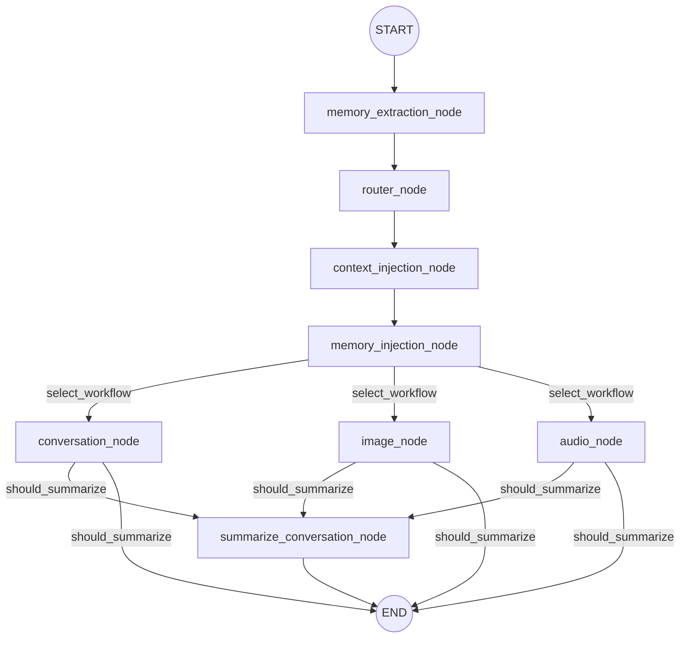

## Architecture

```mermaid
graph TD
    START((START)) --> MEM_EXT[memory_extraction_node]
    MEM_EXT --> ROUTER[router_node]
    ROUTER --> CTX_INJ[context_injection_node]
    CTX_INJ --> MEM_INJ[memory_injection_node]
    
    MEM_INJ -- select_workflow --> CONV[conversation_node]
    MEM_INJ -- select_workflow --> IMG[image_node]
    MEM_INJ -- select_workflow --> AUD[audio_node]
    
    CONV -- should_summarize --> SUMM[summarize_conversation_node]
    IMG -- should_summarize --> SUMM
    AUD -- should_summarize --> SUMM
    
    CONV -- should_summarize --> END((END))
    IMG -- should_summarize --> END
    AUD -- should_summarize --> END
    
    SUMM --> END
```